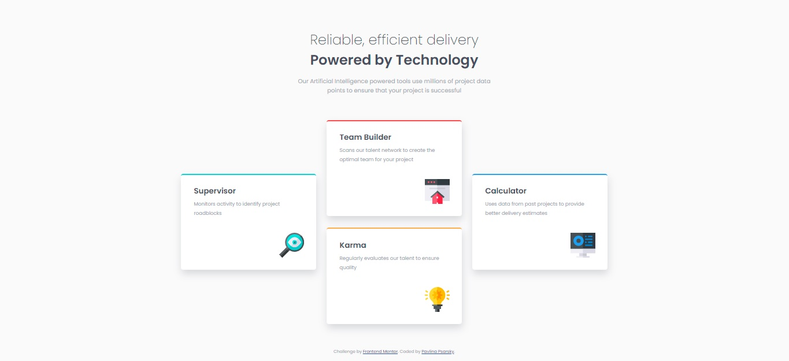
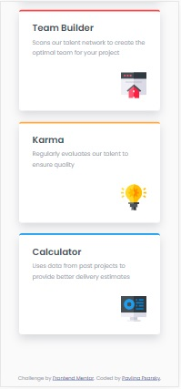

# Frontend Mentor - Four card feature section solution

This is a solution to the [Four card feature section challenge on Frontend Mentor](https://www.frontendmentor.io/challenges/four-card-feature-section-weK1eFYK). Frontend Mentor challenges help you improve your coding skills by building realistic projects. 

## Table of contents

- [Overview](#overview)
  - [The challenge](#the-challenge)
  - [Screenshot](#screenshot)
  - [Links](#links)
- [My process](#my-process)
  - [Built with](#built-with)
  - [What I learned](#what-i-learned)
  - [Continued development](#continued-development)
  - [Useful resources](#useful-resources)
- [Author](#author)
- [Acknowledgments](#acknowledgments)

## Overview

### The challenge

Users should be able to:

- View the optimal layout for the site depending on their device's screen size

### Screenshot

| Desktop layout |
|:--:|


| Mobile layout |
|:--:|
 

### Links

- Solution URL: https://github.com/PavlinaPs/four-card-feature-section
- Live Site URL: https://pavlinaps.github.io/four-card-feature-section/

## My process

### Built with

- Semantic HTML5 markup
- CSS custom properties
- CSS Grid areas
- Mobile-first workflow

### What I learned

I refreshed what I know about grid areas and used them for the desktop layout in this challenge, this time a grid area without creating areas template. 
I created a grid of 3 columns and 4 rows:
```css
@media (min-width: 70em) {
  .section__cards-container {
    display: grid;
    grid-template-columns: repeat(3, 1fr);
    grid-column-gap: 2.8rem;
    grid-template-rows: repeat(4, 0.5fr);
  }
}
```
And then assigned each card its position:
```css
@media (min-width: 70em) {
  .section__card--1 {
    grid-area: 2/1/4/2;
  }
}
```

### Continued development

I need to word more on setting widths so the layout stays responsive.

### Useful resources

- I learned a lot about grid in freeCodeCamp in the [Responsive Web Design, CSS Grid section](https://www.freecodecamp.org/learn/responsive-web-design/#css-grid)

## Author

- GitHub - [PavlinaPs](https://github.com/PavlinaPs)
- Frontend Mentor - [@PavlinaPs](https://www.frontendmentor.io/profile/PavlinaPs)

## Acknowledgments

It is great that I can solve Frontend Mentor's challenges. They are all very useful for me. As is freeCodeCamp. Thank you!